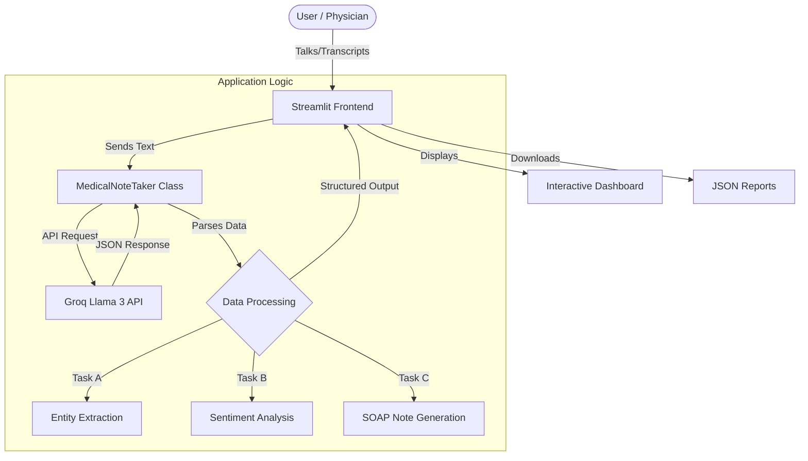

# 🩺 Physician Notetaker AI

[](https://www.python.org/)
[](https://streamlit.io/)
[](https://groq.com/)
[](https://opensource.org/licenses/MIT)

**Physician Notetaker AI** is an advanced clinical documentation tool that transforms raw doctor-patient conversations into structured medical notes. Powered by **Groq Llama 3**, it delivers high-speed, accurate extraction of medical entities, sentiment analysis, and professional SOAP notes.

---

## 🏗️ Architecture



---

## ✨ Features

*   **⚡ High-Speed Inference**: Utilizes Groq's LPU inference engine for near-instant analysis.
*   **🏥 Medical Entity Extraction**: Automatically identifies **Symptoms**, **Diagnoses**, **Treatments**, and **Prognosis**.
*   **🧠 Sentiment & Intent Analysis**: Detects patient tone (`Anxious`, `Reassured`) and visit intent.
*   **📝 SOAP Note Generation**: specific structured report format (Subjective, Objective, Assessment, Plan).
*   **🔒 Privacy-First UI**: Minimalist interface with no local data persistence.

---

## 🚀 Installation

1.  **Clone the Repository**
    ```bash
    git clone https://github.com/architpr/Physician-Notetaker.git
    cd Physician-Notetaker
    ```

2.  **Create Virtual Environment**
    ```bash
    python -m venv venv
    # Windows
    .\venv\Scripts\Activate
    # Mac/Linux
    source venv/bin/activate
    ```

3.  **Install Dependencies**
    ```bash
    pip install -r requirements.txt
    ```

---

## 💻 Usage

1.  **Run the Application**
    ```bash
    streamlit run app.py
    ```

2.  **Enter Transcript**: Paste a dialogue between a doctor and a patient.
3.  **Analyze**: Click "Analyze Conversation".
4.  **Download**: Export the generated SOAP note as a JSON file.

---

## 📂 Project Structure

```
Physician-Notetaker/
├── app.py                  # Main Streamlit Application
├── physician_notetaker.py  # Core Backend Logic (Groq Integration)
├── requirements.txt        # Python Dependencies
├── README.md               # Documentation
└── .gitignore              # Ignored files
```

---

## 🔧 Configuration

The application uses an internal API key for demonstration. To use your own key, update `physician_notetaker.py` or sets `GROQ_API_KEY` in your environment variables.

---

*Built for the Advanced Medical NLP Assignment.*
